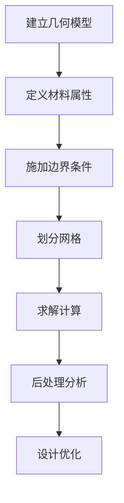

# 电子封装仿真

电子封装是集成电路制造的关键环节，仿真技术在封装设计和优化中发挥重要作用。

## 📦 什么是电子封装？

电子封装是将芯片保护、连接并集成到系统中的技术，主要包括：
- **芯片封装** - 保护芯片，提供电气连接
- **PCB 设计** - 印刷电路板布局和热管理
- **散热设计** - 热管理和热控制

## 🎯 仿真目标

| 目标 | 说明 | 关键指标 |
|------|------|----------|
| **热管理** | 控制芯片温度 | 结温、热阻 |
| **可靠性** | 保证长期稳定 | 疲劳寿命、应力 |
| **性能** | 优化电热性能 | 热阻、功耗 |

## 📚 学习内容

### COMSOL 案例
- [芯片热分析](/comsol/electronic-packaging/chip-thermal)
- [PCB 热仿真](/comsol/electronic-packaging/pcb-thermal)
- [封装热阻计算](/comsol/electronic-packaging/thermal-resistance)
- [焊点应力分析](/comsol/electronic-packaging/solder-stress)
- [热循环疲劳](/comsol/electronic-packaging/thermal-cycling)

### ANSYS 案例
- [Icepak 热仿真](/ansys/electronic-packaging/icepak)
- [PCB 热分析](/ansys/electronic-packaging/pcb-thermal)
- [封装热阻](/ansys/electronic-packaging/thermal-resistance)
- [跌落仿真](/ansys/electronic-packaging/drop-test)

## 🔧 典型仿真流程

## 📊 关键参数

### 热参数
| 参数 | 符号 | 单位 | 典型值 |
|------|------|------|--------|
| 热导率 | k | W/(m·K) | 材料相关 |
| 热阻 | Rth | K/W | < 1 K/W |
| 结温 | Tj | °C | < 150°C |
| 热耗散 | P | W | 设计相关 |

### 结构参数
| 参数 | 符号 | 单位 | 典型值 |
|------|------|------|--------|
| 杨氏模量 | E | GPa | 材料相关 |
| 泊松比 | ν | - | 0.3 |
| 热膨胀系数 | CTE | ppm/K | 3-20 |
| 屈服强度 | σy | MPa | 材料相关 |

## 💡 设计考虑

### 热设计
1. **散热路径优化** - 减少热阻
2. **热界面材料选择** - 提高传热效率
3. **散热器设计** - 增大散热面积

### 结构设计
1. **应力控制** - 避免应力集中
2. **疲劳寿命** - 预测热循环寿命
3. **翘曲控制** - 减小封装变形

## 📖 学习建议

1. **先学热分析** - 掌握传热基础
2. **再学结构分析** - 理解力学原理
3. **最后学耦合分析** - 多物理场仿真

---

::: tip 提示
电子封装仿真通常涉及多个物理场，建议先从单一物理场分析开始，逐步过渡到耦合分析。
:::
