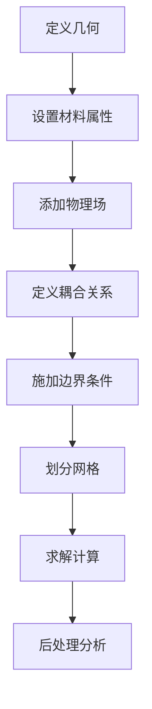

# 热-电-力耦合仿真

热-电-力耦合分析是研究材料在温度场、电场和应力场共同作用下的行为，广泛应用于电子器件、功率模块等领域。

## 🔗 什么是多物理场耦合？

多物理场耦合是指多个物理场之间相互影响的现象：

```
温度场 ⟷ 电场 ⟷ 应力场
```

### 耦合关系
| 耦合类型 | 物理现象 | 应用场景 |
|----------|----------|----------|
| 电-热 | 焦耳热效应 | 功率器件 |
| 热-力 | 热应力/热膨胀 | 封装应力 |
| 电-力 | 电致伸缩 | MEMS 器件 |
| 热-电-力 | 全耦合 | 复杂器件 |

## 🎯 常见耦合问题

### 1. 焦耳热分析
电流通过导体产生热量：
```
Q = I²R = J²/σ
```

### 2. 热应力分析
温度变化导致的应力：
```
σ = E × α × ΔT
```

### 3. 电迁移分析
电流导致的原子迁移

### 4. 热循环疲劳
温度循环导致的疲劳失效

## 📚 学习内容

### COMSOL 案例
- [焦耳热分析](/comsol/thermal-electrical-mechanical/joule-heating)
- [热应力分析](/comsol/thermal-electrical-mechanical/thermal-stress)
- [电迁移分析](/comsol/thermal-electrical-mechanical/electromigration)
- [MEMS 器件仿真](/comsol/thermal-electrical-mechanical/mems)

### ANSYS 案例
- [电热耦合](/ansys/thermal-electrical-mechanical/electrothermal)
- [热应力分析](/ansys/thermal-electrical-mechanical/thermal-stress)
- [功率模块仿真](/ansys/thermal-electrical-mechanical/power-module)

## 🔧 耦合仿真流程



## 📊 关键参数

### 电学参数
| 参数 | 符号 | 单位 | 说明 |
|------|------|------|------|
| 电导率 | σ | S/m | 电流传输能力 |
| 介电常数 | ε | F/m | 电场存储能力 |
| 电阻率 | ρ | Ω·m | σ 的倒数 |

### 热学参数
| 参数 | 符号 | 单位 | 说明 |
|------|------|------|------|
| 热导率 | k | W/(m·K) | 热传导能力 |
| 比热容 | c | J/(kg·K) | 热存储能力 |
| 密度 | ρ | kg/m³ | 质量密度 |

### 力学参数
| 参数 | 符号 | 单位 | 说明 |
|------|------|------|------|
| 杨氏模量 | E | GPa | 刚度 |
| 泊松比 | ν | - | 横向变形 |
| 热膨胀系数 | α | 1/K | 热变形 |

## 💡 设计考虑

### 热设计
1. **散热路径** - 优化热传导路径
2. **热界面** - 减少接触热阻
3. **热应力** - 控制温度梯度

### 电设计
1. **电流密度** - 避免过载
2. **电场分布** - 防止击穿
3. **阻抗匹配** - 优化功率传输

### 结构设计
1. **应力控制** - 避免应力集中
2. **疲劳寿命** - 预测使用寿命
3. **变形控制** - 减小热变形

## 📖 学习建议

1. **先学单物理场** - 分别掌握热、电、力分析
2. **再学两场耦合** - 电-热、热-力耦合
3. **最后学全耦合** - 热-电-力全耦合分析

---

::: tip 提示
多物理场耦合仿真的关键是理解各物理场之间的相互作用关系，建议从简单案例开始学习。
:::
