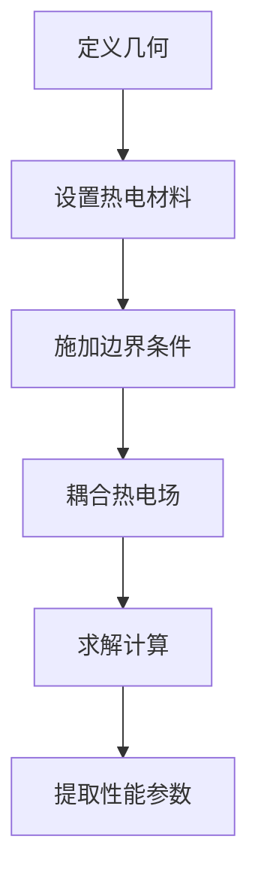

# 热电材料仿真

热电材料能够将热能直接转换为电能（Seebeck效应）或将电能转换为热能（Peltier效应），在能源和制冷领域有重要应用。

## ⚡ 热电效应

### Seebeck 效应
当导体两端存在温差时，会产生电压：
```
V = S × ΔT
```
其中：S 为 Seebeck 系数，ΔT 为温差

### Peltier 效应
当电流通过导体时，会在两端产生温差：
```
Q = π × I
```
其中：π 为 Peltier 系数，I 为电流

### Thomson 效应
当电流通过有温度梯度的导体时，会吸收或释放热量：
```
Q = τ × I × ∇T
```

## 🎯 热电优值 ZT

热电材料的性能由无量纲优值 ZT 表征：

```
ZT = S²σT / κ
```

| 参数 | 说明 | 单位 |
|------|------|------|
| S | Seebeck 系数 | μV/K |
| σ | 电导率 | S/m |
| T | 绝对温度 | K |
| κ | 热导率 | W/(m·K) |

### 典型材料 ZT 值
| 材料 | ZT 值 | 温度范围 |
|------|-------|----------|
| Bi₂Te₃ | 1.0 | 室温 |
| PbTe | 2.0 | 中温 |
| SnSe | 2.6 | 高温 |

## 📚 学习内容

### COMSOL 案例
- [Seebeck 效应仿真](/comsol/thermoelectric/seebeck)
- [Peltier 效应仿真](/comsol/thermoelectric/peltier)
- [热电模块仿真](/comsol/thermoelectric/module)
- [ZT 值优化](/comsol/thermoelectric/zt-optimization)

### ANSYS 案例
- [热电器件仿真](/ansys/thermoelectric/device)
- [温度场分析](/ansys/thermoelectric/temperature)

## 🔧 仿真流程



## 📊 关键参数设置

### 材料参数
| 参数 | 符号 | 单位 | 典型值 |
|------|------|------|--------|
| Seebeck 系数 | S | μV/K | 100-300 |
| 电导率 | σ | S/m | 10³-10⁵ |
| 热导率 | κ | W/(m·K) | 1-10 |
| 电子热导率 | κₑ | W/(m·K) | 0.5-5 |
| 晶格热导率 | κₗ | W/(m·K) | 0.5-5 |

### 边界条件
- **热边界**：温度、热流、对流
- **电边界**：电压、电流
- **耦合边界**：热电接触

## 💡 应用领域

### 发电应用
- 废热回收
- 航天器电源
- 远程供电

### 制冷应用
- 电子器件冷却
- 精密温控
- 便携式制冷

## 📖 学习建议

1. **理解物理原理** - 掌握热电效应本质
2. **学习材料特性** - 了解常用热电材料
3. **掌握仿真方法** - 熟悉热电耦合建模
4. **进行参数优化** - 学习优化设计方法

---

::: tip 提示
热电仿真需要准确的材料参数，建议使用实验数据或文献数据进行验证。
:::
